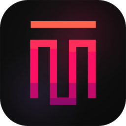

  

<h1 align="center">TM Code</h1>

  <strong>O IDE onde a IA programa por ti.</strong>

  Descreve o que queres. Vê o código nascer. Entrega mais rápido.

  
  
  

---

## E se programar fosse uma conversa?

A maioria dos IDEs foi feita para escrever código. O TM Code foi feito para **pensar código**.

Tu descreves o que precisas — numa conversa natural, como farias com um colega. O agente de IA escreve o código, mostra-te as alterações linha a linha, corre o projecto e abre uma pré-visualização ao vivo. Tudo acontece na mesma janela, sem trocar de separador.

Quando quiseres mexer no código com as tuas próprias mãos, o editor completo está a um clique. Mas provavelmente vais preferir continuar a conversa.

## O que muda na forma como trabalhas

**Tu dizes. O agente constrói.**

- **Começa pelo chat** — Não precisas de abrir ficheiros nem lembrar-te de sintaxe. Diz o que queres e vê acontecer.
- **Pré-visualização ao vivo** — Vê a tua aplicação a correr em tempo real enquanto o agente escreve cada linha.
- **Alterações visíveis** — Cada mudança no código aparece como um diff que podes aceitar ou rejeitar antes de aplicar.
- **Vários modelos de IA** — Escolhe entre múltiplos modelos de linguagem, cada um com os seus pontos fortes.
- **Terminal integrado** — O agente corre comandos por ti, mas tens sempre acesso ao terminal quando precisares.
- **Ferramentas externas (MCP)** — Liga bases de dados, APIs e serviços directamente ao fluxo de trabalho do agente.
- **Projectos prontos a usar** — Começa com templates para React, Next.js, Vue, Svelte, Angular, Express, NestJS e mais.
- **Isolamento por projecto** — Cada projecto pode correr no seu próprio ambiente isolado, sem conflitos.

## Para quem é o TM Code?

- **Programadores que querem entregar mais rápido** — Menos tempo a configurar, mais tempo a criar.
- **Quem está a aprender** — Descreve o que queres e aprende com o código que o agente gera.
- **Equipas pequenas que fazem o trabalho de equipas grandes** — Um agente que multiplica a tua capacidade.
- **Criadores que pensam em produto, não em sintaxe** — Foca-te no "quê" e deixa o "como" para o agente.

## Transferir

| Plataforma | |
|---|---|
| macOS (Apple Silicon) | [Transferir .dmg](https://github.com/ToqueMedia/TM-Code/releases/latest) |
| Windows | [Transferir .exe](https://github.com/ToqueMedia/TM-Code/releases/latest) |
| Linux (Ubuntu/Debian) | [Transferir .deb](https://github.com/ToqueMedia/TM-Code/releases/latest) |

---

  Feito por <a href="https://toquemedia.net">Toque Media, Lda.</a>

