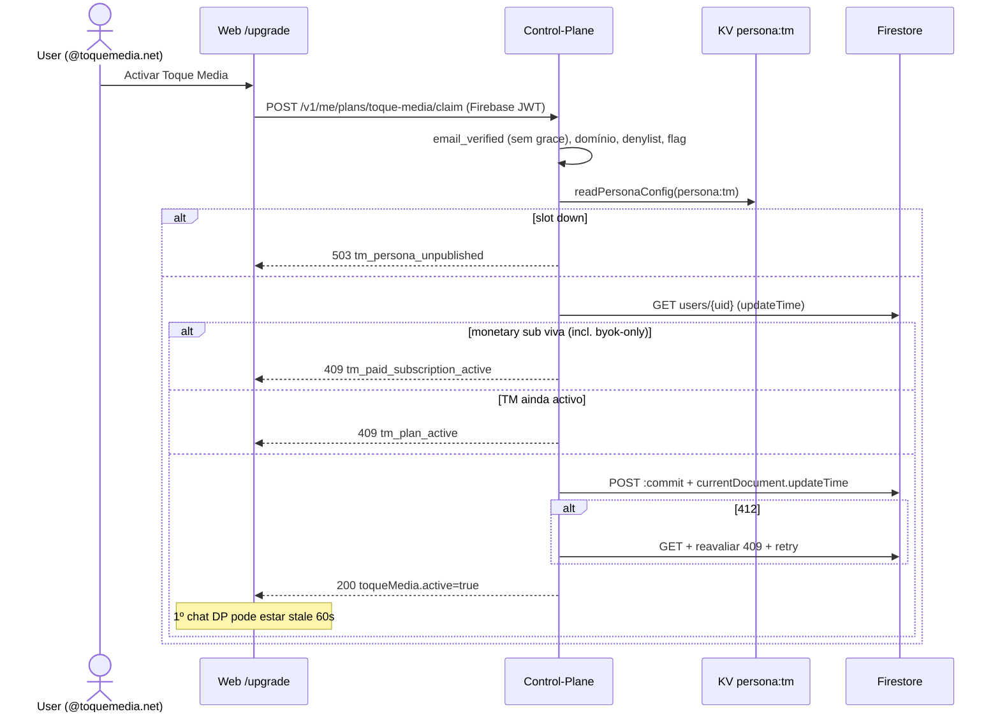
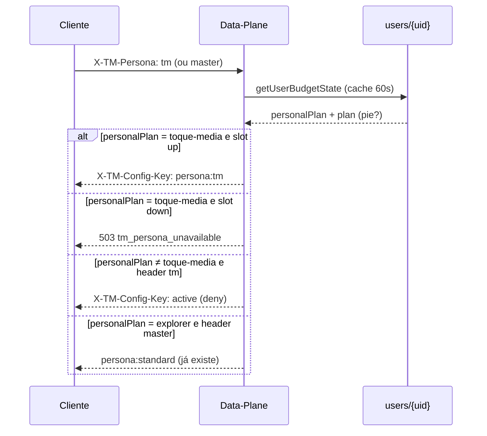
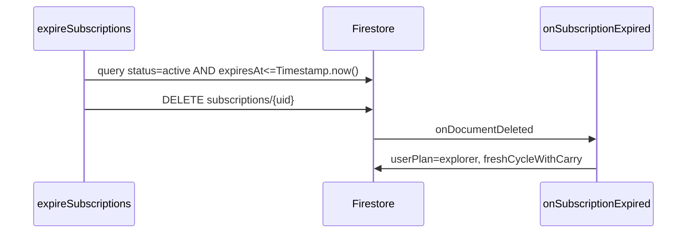

# Plano Toque Media — Design + Gap Analysis

| Campo | Valor |
|---|---|
| **Documento** | Plano Toque Media (grant de domínio + persona TM + envelope 100%) |
| **Autor** | TM Code Architect |
| **Data** | 2026-08-18 |
| **Estado** | Ready / Decided (rev. 3 — PO 2026-08-18) |
| **Componentes** | IDE (`exodus-ide`) · Data-Plane (`workers/ai-pass-through`) · Control-Plane (`toquemedia-studio-api`) · Web (`toquemedia-studio`) |
| **Doutrina** | [`ARCHITECTURE.md`](file:///Users/ithustle/dev/deskotp/exodus-ide/ARCHITECTURE.md) (2026-06-17 / metering 30/70 2026-08-11) |

---

## Overview

O plano **Toque Media** é um grant **gratuito, mensal, só para emails verificados `@toquemedia.net`**. Não passa por Dodo/Momenu. Activa um envelope de **$25 em µ$ a 100%** (sem margem 30/70) e **trava o utilizador à persona `tm`** — o modelo é escolhido pelo admin no slot `persona:tm`, nunca pelo cliente.

O lock é **bidireccional**: (1) quem tem o plano pessoal `toque-media` é forçado a `persona:tm` (503 se o slot estiver down); (2) quem **não** tem esse plano pessoal **não pode** obter `persona:tm` mesmo com `X-TM-Persona: tm`. Publicar o KV **só depois** do deny estar em produção.

O grant vive no **Control-Plane** (`POST /v1/me/plans/toque-media/claim`): as Cloud Functions autenticam com token RSA (`authMiddleware`); a IDE e o `billingService` já falam Firebase JWT com o CP. Re-activação **manual após `planExpiresAt`**. Compare-and-swap via `currentDocument.updateTime`. `expiresAt` é `timestampValue` RFC3339 Z para o cron `expireSubscriptions` o apanhar.

---

## Background & Motivation

### Estado actual

Quatro planos pessoais + dois especiais:

| `UserPlan` | Dinheiro | Envelope (fallback de código) | Personas | Créditos |
|---|---|---|---|---|
| `explorer` | $0 | 1,5M **tokens** | só `standard` (DP degrada) | não |
| `vibe` | checkout | sticker web **$15** → `computePlanBudget` $10,50; DP hardcoded $7,00 (70% de $10 interno) | standard/expert/master | sim |
| `pro` | checkout | sticker web **$29** → `computePlanBudget` $20,30; DP/CP hardcoded $17,50 (70% de $25) | idem | sim |
| `max` | checkout | sticker web **$180** → `computePlanBudget` $126,00; DP hardcoded $70,00 (70% de $100 interno) | idem | sim |
| `welcome` | promo | $22,40 µ$ | como pago | `PLAN_LIMITS.canBuyCredits: true`, mas `canBuyTmsExtras` **não** inclui |
| `byok-only` | legado $3 | 0 µ$ | n/a (BYOK) | não |

Os envelopes hardcoded DP/CP (`$10/$25/$100` × 0,70) **divergem** dos stickers web (`PLAN_PRICING`: vibe $15, pro $29, max $180). Isto **não se corrige neste projecto**. Não copiar a linha `$10/$25/$100` para comentários de código novos.

Fonte partilhada: `packages/shared/src/types/devstudio.ts`. Espelhos: IDE `src/stores/billingStore.ts` (`UserPlanName`), Control-Plane `src/types.ts` + `firestore.ts` `PLAN_DEFAULTS`, Data-Plane `DEFAULT_PLAN_BUDGETS`.

Staff hoje: `isStaffEmail` / `STAFF_EMAIL_DOMAIN = '@toquemedia.net'` / promoção `staff-toquemedia-50` — **50% em planos pagos**, não um plano grátis.

Personas hoje: `standard | expert | master`. IDE manda `X-TM-Persona`; DP roteia `persona:*` **sem** gate de plano (`getConfigForRequest` ~448–453). Único lock server-side: explorer → standard (`index.ts` 367–380).

Welcome: `getUserData` (`firestore.ts` 640–653) **recupera** `userPlan='welcome'` se `welcomePlanClaimed && welcomePlanExpiresAt` ainda vivos — corre **antes** do ramo de expiry da subscription e **não** persiste `userPlan`. Legacy docs ainda têm estes campos; as rules (2026-06-11) já proíbem o cliente de os escrever.

BYOK pessoal: `SettingsView.tsx` 101–106 — o check `subscription_plans.byokAllowed` e o kill-switch `features.byokEnabled` foram **removidos**. BYOK está sempre disponível no caminho do cliente (fala com o provider, não passa pelo lock do DP).

Equipa: `getUserBudgetState` **substitui** `state.plan` pelo `planTier` (`team-pro`/`team-max`) quando `activeTeamId` resolve. `/v1/me` remapeia `plan` para `'pro'`/`'max'` (H4). O lock **não pode** ler esse `plan`.

### Dor

Não existe um plano interno com modelo exclusivo, envelope integral e claim $0. Staff ou paga (mesmo com 50%) ou usa Explorer. O welcome client-write está morto pelas rules — não se copia.

### Drift de preço Pro (fora de âmbito)

| Fonte | Pro mensal | Envelope Pro |
|---|---|---|
| Web `PLAN_PRICING.pro.monthly.usd` | **$29** | `computePlanBudget` → **20_300_000** µ$ |
| Comentários DP/CP + user | **$25** | `DEFAULT_PLAN_BUDGETS.pro = 17_500_000` |
| Admin `subscription_plans.costBudget` | o que o admin gravou | ganha ao fallback |

**Dono do sticker Pro:** Web `PLAN_PRICING` + doc admin. **Dono do envelope runtime:** `costBudget`. Este trabalho **não** altera o $29. TM usa **$25 notional × 100%** via **special-case** `TOQUE_MEDIA_COST_BUDGET_MICROS` (não `monthlyUsd * (1 - PLAN_MARGIN_RATIO)` — um `planMarginRatio` esquecido no caminho genérico rebentaria 17.5e6).

CP `PLAN_MONTHLY_PRICE_USD` está todo a 0 e **não é lido** por `computePlanBudget` (é um `switch`). Não escrever `PLAN_MONTHLY_PRICE_USD['toque-media']=25` como se fosse o envelope.

---

## Goals & Non-Goals

### Goals

1. Identidade `toque-media` em todos os unions/`Record<UserPlan,…>` que o `tsc` exige.
2. Grant $0 no Control-Plane, gated por email Firebase **verificado** `@toquemedia.net`, com CAS no `updateTime`.
3. Persona `tm` **só** para plano pessoal TM activo: force+503 para eles; **deny** para todos os outros. Cliente esconde o switcher.
4. Envelope **25_000_000 µ$** sem alterar `PLAN_MARGIN_RATIO` global.
5. Envelope esgotado → packs (mesmo mecanismo Pro), preço a partir de $25, crédito 100% do `costBudget`.
6. Re-claim **só depois** de `planExpiresAt` (manual).
7. Manter `staff-toquemedia-50` nos planos pagos.
8. Superfícies UI + testes em cada repo.

### Non-Goals

- Não mudar o sticker $29 do Pro nem o 30/70 dos pagos.
- Não emitir factura Dodo/Momenu a $0.
- Não auto-renovar. Não re-claim mid-cycle.
- Não revogar imediatamente se o email deixar o domínio (ciclo corre até `expiresAt`; re-claim usa JWT actual + denylist).
- Não mostrar o plano na landing (`PLAN_ORDER` / `getPlans`).
- Não fundir com `staff-toquemedia-50`.
- Não reactivar TM Speed.
- Não adicionar `toque-media` a `GIFTABLE_PLAN_IDS`.
- Não inventar um segundo dashboard de feature flags (`features/global` fica como está).
- Não claim in-app na IDE: o staff reclama só em `code.toquemedia.net`. A IDE mostra plano/persona locked e o link de upgrade.
- Não construir o fluxo “cancela a sub Dodo/Momenu + claim” numa só acção. Staff com sub monetária viva recebe 409 até cancelar à parte.
- Não hardcodar o modelo do slot `tm`: o admin escolhe a catalog row no painel no publish (PR O2).

---

## Key Decisions

| # | Decisão | Escolha | Rationale |
|---|---|---|---|
| D1 | Identidade | `'toque-media'` | Kebab-case como `byok-only`. |
| D2 | Rank | `PLAN_TIER_RANK['toque-media'] = 4` (igual a `pro`) | Classe Pro. `TM ↔ pro` não é downgrade. |
| D3 | `isPaidPlan` | **Sim** (inclui TM) | Expiry CF + `TokenBudgetWriter` usam isto para `costConsumed` e downgrade. |
| D4 | `isMonetaryPlan` (novo) | `vibe \| pro \| max \| byok-only` | Dinheiro real. **Merge blocker** nas call sites de `invitee_paid` e `hasActivePaid` (Issue 10). |
| D5 | Checkout | **Não** em `CHECKOUT_PAYABLE_PLANS` | $0. Sem product_id Dodo. |
| D6 | Extras | **Sim** em `canBuyTmsExtras` | Pedido: esgotou → créditos. |
| D7 | Writer do grant | **Control-Plane** `POST /v1/me/plans/toque-media/claim` | CFs = RSA; IDE/Web billing = Firebase JWT. Sem impersonation (D26). |
| D8 | Atomicidade + CAS | `:commit` dos 2 docs **e** `currentDocument.updateTime` no `users/{uid}` do GET. 412 → re-ler e reavaliar 409. | `:commit` só atomiza as writes TM. Sem CAS, um webhook Dodo entre GET e commit perde para o grant. **Não** há TTL nativo fiável — o expiry é o cron `expireSubscriptions` + `onSubscriptionExpired`. |
| D9 | Duração | 30 dias de calendário; `billingAnchorDay = clamp(UTC day, 1, 28)`. **Só mensal — sem claim anual.** Activação manual todos os meses após `expiresAt`. | Decisão PO 2026-08-18. |
| D10 | Claim sobre plano **monetário** activo | **409 `tm_paid_subscription_active`** para `vibe`, `pro`, `max` **e `byok-only`** com `subscription.expiresAt > now`. Cancel first. Sem fluxo combinado “cancela + claim” na v1. | Decisão PO 2026-08-18. Cancelar Dodo/Momenu é das CFs e fica fora deste trabalho. `isMonetaryPlan` fica coerente. |
| D11 | Re-claim | Só se **não** houver sub monetária viva **e** não estiver TM com `expiresAt > now`. Planos de partida: `explorer` / `welcome` / TM já expirado (já explorer via CF). **Não** `byok-only` (D10). | “Apenas após expiração.” |
| D12 | Auto-renew | **Não** | `paymentMethod: 'domain-grant'`. |
| D13 | Envelope | **25_000_000 µ$** special-case | Não passar pelo `monthlyUsd * 0.70`. Teste que falha se alguém apagar o case. |
| D14 | Preço notional TM | `PLAN_PRICING['toque-media'].monthly = { usd: 25, aoa: 31250 }` | Packs: `computeConsumptionPackCharge`. |
| D15 | Packs | `tokens = floor(planBudget × fraction)`; preço = $25 × fraction | Staff 50% no **preço** (email). O crédito continua 100% do pack → **200% efectivo** ($12,50 → 25e6). Não é bug; finance tem de saber (D35). |
| D16 | Persona | Slot `tm` / KV `persona:tm`. **Fora** de `SWITCHABLE_PERSONAS`. | Só o admin e o lock vêem o slot. |
| D17 | Lock DP (force) | Se **`personalPlan === 'toque-media'`** e não sidecar e não studio → força `persona:tm`. Slot down → **503 `tm_persona_unavailable`**. | Nunca o `plan` remapeado da pie. |
| D18 | Sidecars / Studio | Permitidos. Studio = `X-TM-Workspace: studio`. | Doutrina actual. |
| D19 | **Revogado** — ver D34 | — | `byokAllowed: false` no seed **não** tranca nada (`SettingsView` 101–106). |
| D20 | TM Speed | Retired. Se voltar: excluir TM; ignorar `X-TM-Speed` quando `personalPlan === 'toque-media'`. | Speed troca o modelo. |
| D21 | Equipa | Pode ser owner/membro. **Pie** ganha o billing. **Lock de modelo** usa plano **pessoal**. Team BYOK **ganha o modelo** depois do lock. | `state.plan` na pie é `team-pro`/`team-max`. |
| D22 | Unused no expiry | Forfeit envelope; preservar `extraUsageBalance`; carry overshoot não pago | `freshCycleWithCarry`. |
| D23 | Email change | Ciclo corre até `expiresAt`. Re-claim = JWT actual. | Sem kill-switch no ciclo em curso. |
| D24 | Staff 50% | Manter em vibe/pro/max e em **packs** TM. Não no claim $0. | Ortogonal. |
| D25 | Superfície pública | Sem card na landing. Card em `/upgrade` + account se `toqueMedia.eligible`. | Seed `adminOnly: true` para `getActivePlans()` não devolver TM ao `CheckoutPage`. |
| D26 | Admin-gift / force | **Não** em `GIFTABLE_PLAN_IDS`. Force-grant = `POST /v1/admin/users/{uid}/plans/toque-media` (admin JWT, alvo ainda tem de ser `@toquemedia.net` verificado) **ou** script Admin SDK. **Sem** impersonation no claim do user. | CP não tem API de impersonation. |
| D27 | Quotas + `PLAN_LIMITS` | Iguais a Pro, incluindo `canBuyCredits: true` | `Record<UserPlan, PlanLimits>` falha o `tsc` sem a entrada. |
| D28 | Email verified | Claim exige `email_verified === true` **no handler**, sem grace. **Não** reutilizar `checkSignupGates` para isto (esse tem 24h). | $25 de grant. |
| D29 | Fonte do email | Token `decoded.email` | Plus-address sim; subdomínio não. |
| D30 | SoT preço TM | Seed `costBudget=25000000` + `monthlyUsd=25`. Fallback = constant 25e6 nos 3 `computePlanBudget` / `DEFAULT_PLAN_BUDGETS`. | Cache miss não pode cair em 0 nem em 70%. |
| D31 | Lock DP (deny) | Se o header/resolução é `tm` / `persona:tm` e **`personalPlan !== 'toque-media'`** → **ignorar** o header e servir `active` (mesmo padrão explorer→standard). Não 403 (fail-open de UX; o modelo staff não vaza). | Sem isto, qualquer Pro pede o modelo staff. |
| D32 | Welcome flags | Claim **apaga** `welcomePlanClaimed` e `welcomePlanExpiresAt`. Recovery no-op se `userPlan === 'toque-media'` **ou** `subscription.paymentMethod === 'domain-grant'` com `expiresAt` futuro. | Senão `/v1/me` reporta welcome e o DP mete TM (split-brain). |
| D33 | Chave do lock cliente | `toqueMedia.active` de `/v1/me` (plano **pessoal** + sub viva). **Nunca** `billingStore.plan` (H4 remapeia pie → pro/max). Headers `X-Plan` em team mode **não** desligam o lock. | IDE e Web alinhados. |
| D34 | BYOK pessoal | **Re-gate:** se `toqueMedia.active`, IDE/Web **não** entram no caminho BYOK (esconder API keys route / forçar managed). O DP não vê BYOK pessoal (sai directo ao provider) — o gate é cliente+`runClient`. **Não** semear `byokAllowed: false` como se fosse lock. Team BYOK continua a ganhar (D21). | Campo admin está morto no chat path. |
| D35 | Packs staff 50% | Preço a metade, crédito **cheio** (200% efectivo) | `getStaffPromotion` é por email; `computeConsumptionPackCharge.tokens` não desconta. Documentar; não “corrigir” na v1. |
| D36 | Offboarding | Denylist `toque_media_denylist/{uid}` consultada no claim. Apagar `subscriptions/{uid}` só acaba o ciclo. Desactivar o user no Workspace impede login. | Sem denylist, quem mantém o Gmail `@toquemedia.net` re-claima para sempre. |
| D37 | Primeiro ciclo µ$ | Claim **reutiliza** `tokenBudgetToFirestoreFields` com `planId: 'toque-media'` | Sem `planId`, o encoder escreve `tokensConsumed` (explorer) até o `/v1/me` reescrever. |
| D38 | Flag | Env CP `TOQUE_MEDIA_CLAIM_ENABLED` (off até smoke). **Não** adicionar a `features/global` (`FeatureFlags` hoje só tem `byokEnabled`). | Um knob, sem segundo dashboard. |
| D39 | Cache DP pós-claim | Isolates do DP cacheiam `getUserBudgetState` **60s**. `/v1/me` já é fresh (sem `cache: true`). Sem bust v1. UI: “A activar… o 1º chat pode levar até 1 min.” Smoke espera ≥60s ou isolate novo. | Não há sinal do CP para os isolates do DP. |

---

## Proposed Design

### Identidade e helpers

Em `@studio/shared` (`devstudio.ts`) — fonte canónica — e espelhos IDE/CP:

```ts
export type UserPlan =
  | 'explorer' | 'vibe' | 'pro' | 'max' | 'byok-only' | 'welcome' | 'toque-media'

export function isPaidPlan(plan: UserPlan | string | undefined): boolean {
  return plan === 'vibe' || plan === 'pro' || plan === 'max'
      || plan === 'byok-only' || plan === 'toque-media'
}

export function isMonetaryPlan(plan: UserPlan | string | undefined): boolean {
  return plan === 'vibe' || plan === 'pro' || plan === 'max' || plan === 'byok-only'
}

export function isComplimentaryGrantPlan(plan: UserPlan | string | undefined): boolean {
  return plan === 'welcome' || plan === 'toque-media'
}

export type TmsExtrasEligiblePlan = Extract<UserPlan, 'vibe' | 'pro' | 'max' | 'toque-media'>
export const TMS_EXTRAS_ELIGIBLE_PLANS = ['vibe', 'pro', 'max', 'toque-media'] as const
export function canBuyTmsExtras(plan: string | undefined): plan is TmsExtrasEligiblePlan {
  return plan === 'vibe' || plan === 'pro' || plan === 'max' || plan === 'toque-media'
}

export const PLAN_TIER_RANK: Record<string, number> = {
  explorer: 0, 'byok-only': 1, welcome: 2, vibe: 3,
  pro: 4, 'toque-media': 4, max: 5,
}

export const TOQUE_MEDIA_MONTHLY_USD = 25
export const TOQUE_MEDIA_COST_BUDGET_MICROS = 25_000_000

export function computePlanBudget(plan: UserPlan): number {
  if (plan === 'explorer') return EXPLORER_MONTHLY_TOKEN_CAP
  if (plan === 'byok-only') return 0
  if (plan === 'welcome') return WELCOME_COST_BUDGET_MICROS
  if (plan === 'toque-media') return TOQUE_MEDIA_COST_BUDGET_MICROS // obrigatório — não cair no 0.70
  const monthlyUsd = (PLAN_PRICING as any)[plan]?.monthly?.usd ?? 0
  if (monthlyUsd <= 0) return 0
  return Math.floor(monthlyUsd * (1 - PLAN_MARGIN_RATIO) * 1_000_000)
}
```

`CheckoutPayablePlan` **não muda**. `PLAN_MARGIN_RATIO` global **não muda**. Não é obrigatório um `planMarginRatio()` se o special-case TM existir e tiver teste.

`PLAN_LIMITS['toque-media']` = cópia de `PLAN_LIMITS.pro` (`canBuyCredits: true`, `maxProjects: 5`, etc.).

`PLAN_PRICING['toque-media']` = `{ monthly: { usd: 25, aoa: 31250 }, annual: { usd: 300, aoa: 375000 } }`.

`VALID_USER_PLANS` inclui `'toque-media'`. `sanitizeUserPlan` **não tem call sites hoje** — não é SoT de `/v1/me` (o CP faz cast cru de `fields.userPlan`). Incluir o literal para o set não o dropar no futuro.

`Subscription.paymentMethod` e o union em `UserProfile.ts`:

```ts
paymentMethod: 'mcx' | 'reference' | 'dodo' | 'admin-gift' | 'domain-grant'
```

`proration.isNonMonetaryPayment`: `admin-gift` **ou** `domain-grant`. Sem isto, método desconhecido credita as duas moedas.

`isStaffEmail` no CP: 8 linhas em `toqueMediaGrant.ts` (CP não importa `@studio/shared`).

### Elegibilidade (server)

```
eligible  = email_verified === true
         && isStaffEmail(token.email)
         && !denylist.has(uid)
canClaim  = eligible
         && !hasActiveMonetarySubscription   // vibe|pro|max|byok-only && expiresAt > now
         && !(personalPlan === 'toque-media' && expiresAt > now)
         && claimFlagOn
         && personaTmPublished
```

`hasActiveMonetarySubscription` lê `users/{uid}.userPlan` **e** `users/{uid}.subscription.expiresAt` (`timestampValue`). `byok-only` com sub viva → 409.

| Caso | `eligible` | `canClaim` | Código |
|---|---|---|---|
| `ana@toquemedia.net` verificada, explorer | sim | sim | 200 |
| `ana+dev@toquemedia.net` | sim | sim | plus-address |
| `ana@eng.toquemedia.net` | não | não | `tm_domain_required` |
| email não verificado | não | não | `tm_email_unverified` |
| `gmail.com` | não | não | `tm_domain_required` |
| já TM com `expiresAt` futuro | sim | não | `tm_plan_active` |
| vibe / pro / max activo | sim | não | `tm_paid_subscription_active` |
| **byok-only** com sub viva | sim | **não** | `tm_paid_subscription_active` |
| TM expirado (já explorer) | sim | sim | re-claim |
| welcome activo | sim | sim | substitui welcome; **apaga flags** |
| na denylist | não | não | `tm_denied` |
| membro de equipa, pessoal explorer | sim | sim | `userPlan` pessoal muda; pie intacta |

`/v1/me` (calculado a partir do **userData pessoal**, antes do remap H4):

```ts
toqueMedia?: {
  eligible: boolean
  canClaim: boolean
  active: boolean   // personal userPlan==='toque-media' && sub viva
  reason?: 'unverified' | 'wrong_domain' | 'already_active'
         | 'paid_subscription_active' | 'denied' | 'claim_disabled' | 'persona_unpublished'
  expiresAt?: string
}
```

Em team mode o JSON continua com `plan: 'pro'|'max'` (H4) **e** `toqueMedia.active: true`. Clientes de lock lêem `toqueMedia.active`.

### Persona TM

**Listas**

```ts
// personaStore.ts (IDE e Web) — a lista PÚBLICA nunca inclui tm
export const SWITCHABLE_PERSONAS = ['standard', 'expert', 'master'] as const
export type SwitchablePersona = (typeof SWITCHABLE_PERSONAS)[number]
export const TM_LOCKED_PERSONA = 'tm' as const
export type Persona = SwitchablePersona | typeof TM_LOCKED_PERSONA
export const PERSONAS = SWITCHABLE_PERSONAS // alias usado pelos selectors
```

Admin (`PersonaType`, `PERSONA_KEYS`, `PERSONA_TO_KEY`, `PERSONA_SLOTS`, `PERSONA_TYPES`) **inclui** `tm`. `writePersonasDoc` itera `PERSONA_KEYS`. Publicar `tm` **não** espelha `active`.

**Não** publicar KV `persona:tm` em prod até o deny (D31) estar no worker de produção.

**Visibilidade**

- Selector mapeia **só** `SWITCHABLE_PERSONAS`.
- Se `toqueMedia.active` → esconder o dropdown; chip estático “TM”.
- Sem `toqueMedia.active`, `tm` nunca aparece mesmo publicado.

**Persist (não vazar `tm`)**

- `setSelected('tm')` é **in-memory only**. **Não** escrever `'tm'` em `tm_model_persona` / `tm_web_model_persona`.
- Ao entrar em `toqueMedia.active`: se o valor actual é switchable, gravar em `tm_model_persona_before_tm` (uma vez).
- Ao sair: restaurar `before_tm` se ainda estiver no mapa `aiPersonas`; senão `standard`. `saveSelected` só com switchable.
- Listener `storage`: se `e.newValue` não é switchable, ignorar (não propagar `tm` para outras janelas como escolha pública).
- `firebaseAuth` / `AuthContext`: incluir `tm` no **mapa** de modelos (effort/janela). Fallback da persona seleccionada:
  - se `toqueMedia.active` e `tm` **ausente** do mapa → **não** reverter para `standard` (UI “indisponível”; DP 503);
  - se **não** `active` e `selected === 'tm'` → `standard`.

**Lock Data-Plane** — depois de `getUserBudgetState`, **antes** de team BYOK. Usar `personalPlan`, nunca `budgetState.plan`:

```ts
// billing.ts — UserBudgetState
personalPlan: string  // users.userPlan, sempre
plan: string          // team.planTier se pie, senão personalPlan (hoje)

// getUserBudgetState: ao montar o ramo de equipa, NÃO descartar o userPlan
state = {
  personalPlan: plan,          // o lido de users.userPlan
  plan: team.planTier,         // como hoje
  ...
}
// ramo pessoal:
state = { personalPlan: plan, plan, ... }
```

```ts
// index.ts — junto ao gate explorer→standard
const personal = budgetState?.personalPlan ?? budgetState?.plan
const requested = (persona ?? '').trim().toLowerCase()
const wantsTm = requested === 'tm' || personaKeyFor(persona) === 'persona:tm'

if (personal === 'toque-media' && !requestedSidecar && !isStudioWorkspace(workspace)) {
  const locked = await getConfigForRequest(env, requestType, 'tm', workspace)
  if (locked.key !== 'persona:tm') {
    return jsonError(503, 'tm_persona_unavailable',
      'The Toque Media persona is not published.')
  }
  active = locked
  config = locked.config
} else if (wantsTm && personal !== 'toque-media' && !requestedSidecar && !isStudioWorkspace(workspace)) {
  // D31 deny: Pro/Vibe/Welcome/explorer/team-remap não obtêm o modelo staff
  const downgraded = await getConfigForRequest(env, requestType, null, workspace) // active
  active = downgraded
  config = downgraded.config
}
```

O ramo explorer→standard existente **mantém-se** (explorer a pedir expert/master).

Team BYOK (bloco seguinte) pode substituir o main path.

**Testes DP (obrigatórios)**

1. `userPlan=toque-media` + `X-TM-Persona: master` → `x-tm-config-key=persona:tm`
2. `userPlan=pro` + `X-TM-Persona: tm` → **não** `persona:tm` (serve `active`)
3. `userPlan=toque-media` + `activeTeamId` + sem team BYOK + `X-TM-Persona: master` → `persona:tm`
4. Slot `persona:tm` down + user TM → 503
5. Sidecar `vision` + user TM → **não** força `persona:tm`

### Envelope 100%

```
costBudget(toque-media) = 25_000_000 µ$
```

Seed `subscription_plans` (`addDoc`, `planKey` no campo):

```
planKey: 'toque-media'
name: 'Toque Media'
monthlyUsd: 25
monthlyAoa: 31250
annualUsd: 300
annualAoa: 375000
costBudget: 25000000
tokenBudget: 25000000          // legado, mesmo valor — NÃO um cap em tokens
byokAllowed: <omitir>          // campo morto no chat path; não fingir lock
byokRequired: false
active: true
adminOnly: true                // getActivePlans() esconde; getAllPlans (admin) mostra
order: 35
color: '#111111'
popular: false
```

Sem `dodoProductId*`. `PLAN_BUDGETS_JSON` de prod: acrescentar `"toque-media": 25000000` se o env estiver pinned.

UpgradePage **não** lê este doc para o card TM — card sintético se `toqueMedia.eligible`.

### Créditos

| Pack | Paga (sticker) | Paga (staff 50%) | Recebe |
|---|---|---|---|
| 50% | $12,50 | $6,25 | 12_500_000 µ$ |
| 100% | $25 | **$12,50 → 25e6 µ$ (200% efectivo)** | 25_000_000 µ$ |

Mensagem CF: incluir Toque Media na allow-list de extras.

### Lifecycle

**Claim** (ver apêndice para o REST):

1. JWT + `checkSignupGates` (activo / signup). **Extra no handler:** `email_verified === true` sem grace (D28).
2. Domain + denylist + flag + `readPersonaConfig(env, 'persona:tm')` enabled.
3. GET `users/{uid}` (guardar `updateTime`).
4. Avaliar 409 (`tm_plan_active` / `tm_paid_subscription_active`).
5. Fresh cycle via a mesma matemática de `computeCarryOver` + `convertExtraAcrossUnits` + `defaultTokenBudget(..., 'toque-media')`. Encoder = `tokenBudgetToFirestoreFields` (D37).
6. `:commit` atómico:
   - `subscriptions/{uid}`: `status: 'active'`, `startedAt`/`expiresAt` como **`timestampValue`** RFC3339 Z, `paymentMethod: 'domain-grant'`, `claimedEmail`.
   - `users/{uid}`: `userPlan`, `subscription` (mesmos timestamps), `tokenBudget`, apagar `_subscriptionLock`, **apagar `welcomePlanClaimed` e `welcomePlanExpiresAt`**. Precondition `currentDocument.updateTime` = o do GET.
7. 412 → GET de novo, reavaliar 409, retry uma vez. Se ainda 412 → 409 `tm_claim_conflict`.
8. Audit `toque_media_claims/{autoId}`. Invalidar `userdata:{uid}` (best-effort; `/v1/me` já não usa essa cache).
9. Rate limit `rl:tmclaim:{uid}:{day}` = 5.

**Welcome recovery** (`firestore.ts` ~640):

```
if (welcomePlanClaimed && welcomePlanExpiresAt && Date.now() < expiryMs) {
  const domainGrantLive = subscription.paymentMethod === 'domain-grant'
    && subscription.expiresAt + 0 > now
  if (planName !== 'toque-media' && !domainGrantLive && planName !== 'welcome') {
    planName = 'welcome'
  }
}
```

Teste CP: flags welcome + `userPlan=toque-media` → `/v1/me.plan === 'toque-media'`.

**Ciclo interno vs 30 dias (PO 2026-08-18):** âncora mensal, paridade Pro. Se o `/v1/me` resetar o ciclo interno antes dos 30 dias da sub, o envelope **volta a 25_000_000 µ$**. Não há envelope único amarrado a `planExpiresAt`.

**Expiry (não é TTL nativo):**

1. Cron diário `expireSubscriptions`: `status==active && expiresAt <= Timestamp.now()` → DELETE. Só funciona se `expiresAt` for **timestamp**.
2. `onSubscriptionExpired`: `isPaidPlan` (inclui TM) → explorer + `freshCycleWithCarry`.
3. `/v1/me`: `expiresAt + 24h` (já cobre TM: `!== explorer && !== welcome`).
4. AuthContext onSnapshot: só UI.

**Pós-claim, 1º chat (D39):** o isolate DP pode ainda ter `personalPlan=explorer` até 60s → gate explorer (1,5M tokens) e deny de `tm`. `/v1/me` já mostra TM. UI avisa. Smoke espera 60s.

**Admin force-grant:** `POST /v1/admin/users/{uid}/plans/toque-media` — `authenticateAdminRequest`, alvo com email verificado `@toquemedia.net`, mesmo `:commit`. Audit `grantedByAdminUid`. Sem isto, ops usa um script Admin SDK one-off (mesmo payload).

**Denylist:** `toque_media_denylist/{uid}` `{ email?, reason, createdAt }`. Rules: write false. Claim GET nesse doc. Ops escreve via console / script.

### Coexistência com `staff-toquemedia-50`

```
/upgrade (@toquemedia.net):
  [ Toque Media · Grátis · Claim ]                      ← canClaim
  [ Toque Media · Activo até DATE ]                     ← already_active
  [ Toque Media · Cancela o plano pago para activar ]   ← paid_subscription_active (inclui byok-only)
  [ Vibe / Pro / Max · −50% staff ]
```

### Equipas

- `addTeamMemberServer` não filtra plano.
- `/v1/me`: `plan` remapeado (H4) + `toqueMedia.active` pessoal.
- DP: force/deny em `personalPlan`; pie em `plan`/`team`; team BYOK depois.
- Packs de equipa: contra o tier. Sem mudança.
- Toggle `/v1/me/billing-mode` inalterado.

### Gifts / referrals / proration

| Fluxo | Comportamento | Call site (merge blocker) |
|---|---|---|
| Admin-gift | Sem TM em `GIFTABLE_PLAN_IDS`. Alvo já TM → 409 (`isPaidPlan`) | `controllerAdmin.ts` 528–529 |
| Referral `invitee_paid` | **`isMonetaryPlan`**, não `isPaidPlan` | `processReferralRewards.ts` **43–45** |
| Referral inviter TM | `isPaidPlan` true → só se o convite **pagar** | mesmo ficheiro |
| Proration `hasActivePaid` | **`isMonetaryPlan`** | `proration.ts` **159** |
| `isNonMonetaryPayment` | `admin-gift` \| `domain-grant` | `proration.ts` **32–34** |
| `isPlanDowngrade(TM, vibe)` | true | checkout bloqueia |
| `isPlanDowngrade(TM, pro)` | false | checkout Pro OK |
| Pro/BYOK → TM | só após cancel/expiry (D10) | — |

`AccountOverview` (`isPaidPlan && plan !== 'max'`) e `ReferralLinkCard`: **obrigatório** no PR de UI — TM não leva banner “faz upgrade para Pro” genérico; copy “renovar Toque Media após DATE / comprar Pro”.

---

## Diagramas

### Claim



### Request — force e deny



### Expiry (cron, não TTL)



---

## API / Interface Changes

### `POST /v1/me/plans/toque-media/claim`

Firebase JWT. Ver apêndice.

**200** — mesmo shape de `/v1/me` (inclui `toqueMedia.active=true`, `budgetCacheMaxAgeSec: 60`).

| HTTP | `code` |
|---|---|
| 401 | JWT inválido |
| 403 | `tm_email_unverified` / `tm_domain_required` / `tm_denied` / gates signup |
| 409 | `tm_plan_active` / `tm_paid_subscription_active` / `tm_claim_conflict` |
| 429 | rate limit |
| 503 | `tm_persona_unpublished` / `tm_claim_disabled` |

### `POST /v1/admin/users/{uid}/plans/toque-media`

Admin JWT. Mesmo `:commit`. 404 se o uid não existe. 403 se o email do alvo não é domínio verificado.

### `GET /v1/me`

`toqueMedia` (D33). Em pie, `plan` continua remapeado.

### Data-Plane

Sem header novo. `UserBudgetState.personalPlan`. `X-Plan` em pie continua `pro`/`max` (H4). Lock **não** lê `X-Plan`.

### IDE / Web types

```ts
// billingStore MeResponse.toqueMedia
// lock: toqueMedia.active, não plan === 'toque-media'
```

`PLAN_DISPLAY['toque-media'] = { label: 'TM', color: tokens.colors.text.primary }`.

### Web checkout

`isCheckoutPayable('toque-media')` → redirect `/upgrade`. Seed `adminOnly: true` para `getActivePlans()` não montar um checkout a $25.

i18n: chaves **`plans.toque-media.name`** (UpgradePage faz `'plans.' + id + '.name'`). Não `plans.toqueMedia.*`.

---

## Data Model Changes

### `users/{uid}`

```
userPlan: 'toque-media'
subscription.planId / billingCycle / paymentMethod:'domain-grant'
subscription.startedAt / expiresAt   → timestampValue RFC3339 Z
tokenBudget via tokenBudgetToFirestoreFields (planId + costConsumed)
welcomePlanClaimed / welcomePlanExpiresAt → DELETE
_subscriptionLock → DELETE
```

### `subscriptions/{uid}`

```
status: 'active'                 // o cron filtra isto
planId: 'toque-media'
paymentMethod: 'domain-grant'
startedAt / expiresAt: timestampValue  // NÃO stringValue
claimedEmail: string
```

Sem TTL nativo. Expiry = cron + trigger.

### `toque_media_claims/{autoId}`

`uid, email, previousPlan, expiresAt, requestId, createdAt, grantedByAdminUid?`. Rules write false.

### `toque_media_denylist/{uid}`

`email?, reason, createdAt`. Rules write false.

### `system/aiPersonas`

Campo `tm` quando publicado.

### Rules

Opcional: match das duas colecções novas com `allow read, write: if false`. Billing fields já são server-only.

### Migração

Sem backfill. Staff actual fica no plano que tem.

---

## Apêndice — claim write (REST)

Helpers existentes: `firestoreCommitUrl`, `firestoreDocUrl`, `tokenBudgetToFirestoreFields`, `readPersonaConfig`, `resolveFirestoreAuthHeaders` / `firestoreAdminAuthHeaders`.

```ts
function rfc3339Z(d: Date): string {
  return d.toISOString() // já é RFC3339 Z
}

function ts(d: Date) {
  return { timestampValue: rfc3339Z(d) }
}

// GET users/{uid} → { fields, updateTime }

const now = new Date()
const expires = new Date(now.getTime() + 30 * 24 * 60 * 60 * 1000)
const fresh = defaultTokenBudget(clampDay(now.getUTCDate()), now, 'toque-media')
fresh.extraUsageBalance = /* convertExtraAcrossUnits se plan-change */
fresh.tokensConsumed = /* carry se mesma unidade */
// NÃO omitir planId — tokenBudgetToFirestoreFields precisa dele para costConsumed

const userName = `projects/${projectId}/databases/(default)/documents/users/${uid}`
const subName  = `projects/${projectId}/databases/(default)/documents/subscriptions/${uid}`

const body = {
  writes: [
    {
      update: {
        name: subName,
        fields: {
          userId: { stringValue: uid },
          planId: { stringValue: 'toque-media' },
          billingCycle: { stringValue: 'monthly' },
          paymentMethod: { stringValue: 'domain-grant' },
          status: { stringValue: 'active' },
          claimedEmail: { stringValue: email },
          startedAt: ts(now),
          expiresAt: ts(expires),
        },
      },
    },
    {
      update: {
        name: userName,
        fields: {
          userPlan: { stringValue: 'toque-media' },
          subscription: { mapValue: { fields: {
            planId: { stringValue: 'toque-media' },
            billingCycle: { stringValue: 'monthly' },
            paymentMethod: { stringValue: 'domain-grant' },
            startedAt: ts(now),
            expiresAt: ts(expires),
          } } },
          tokenBudget: { mapValue: { fields: tokenBudgetToFirestoreFields(fresh) } },
          // campos ausentes + updateMask = delete
        },
      },
      updateMask: { fieldPaths: [
        'userPlan', 'subscription', 'tokenBudget',
        '_subscriptionLock',
        'welcomePlanClaimed', 'welcomePlanExpiresAt',
      ] },
      currentDocument: { updateTime: userUpdateTime },
    },
  ],
}

// POST firestoreCommitUrl(projectId, isEmulator)
// 400 FAILED_PRECONDITION / 412 → refetch + reavaliar
```

Teste: `:commit` com `expiresAt` no passado → a query do cron (`status==active`, `expiresAt<=now`) **devolve** o doc.

Ler o slot: `readPersonaConfig(env, 'persona:tm')` — mesmo helper do GET `/v1/admin/ai/personas`. Recusar se `null` ou `enabled === false`.

---

## Alternatives Considered

### A1. Admin-gift / Dodo $0
Rejeitado. Admin-gift é admin-only e 409 se `isPaidPlan`. Dodo $0 é frágil.

### A2. Grant nas CFs
Rejeitado. RSA vs Firebase JWT.

### A3. Client write welcome
Rejeitado. Rules 2026-06-11.

### A4. `userPlan='pro'` + flag
Rejeitado. Lock e envelope 100% desaparecem.

### A5. Só `costBudget` no Firestore
Insuficiente. Cache miss → 0 ou 70%.

### A6. 403 no deny de `persona:tm`
Rejeitado. Explorer já degrada em silêncio para standard; 403 num header adversarial barulhento. Deny = servir `active`.

### A7. Aceitar BYOK pessoal como opt-out
Rejeitado para v1 (D34). Esvazia “cravado ao modelo TM”. Team BYOK fica (a equipa paga o provider — doutrina existente).

---

## Security & Privacy

| Ameaça | Sev | Mitigação |
|---|---|---|
| Self-upgrade cliente | Crítica | Rules. Grant só CP+SA. |
| `X-TM-Persona: tm` num Pro | Crítica | D31 deny. Publicar KV **depois** do deny. Teste adversarial. |
| `X-TM-Persona: master` num TM | Alta | D17 force. |
| Welcome recovery clobber | Crítica | D32 delete + no-op. |
| Race Dodo vs claim | Alta | D8 `updateTime` + 412 retry. |
| `expiresAt` stringValue | Alta | timestampValue; teste da query do cron. |
| Email não verificado | Alta | D28 no handler. |
| Offboarding com Gmail corporativo vivo | Média | D36 denylist + Workspace disable. |
| BYOK pessoal foge do modelo | Alta | D34 re-gate no cliente. |
| Team BYOK foge | Baixa (aceite) | D21. |
| Claim spam | Média | 5/uid/dia. |
| Impersonation inexistente | — | D26 rota admin explícita. |

---

## Observability

```
[toque-media] CLAIM uid=… email=… previous=explorer expiresAt=… cas=ok
[toque-media] CLAIM_DENIED reason=tm_paid_subscription_active
[toque-media] CLAIM_CONFLICT 412 retry
[persona] forced tm personalPlan=toque-media piePlan=team-pro
[persona] deny tm personalPlan=pro
[persona] tm_persona_unavailable
```

Headers: `X-TM-Config-Key`, `X-Plan` (pie continua remapeado), `X-Budget-*`.

Alertas: 503 `tm_persona_unavailable` > 0; zero claims 48h após flag on.

---

## Rollout Plan

Sequência de **produção** (um comboio; PRs por repo abaixo):

1. **Tipos** em shared + IDE + CP (`tsc` verde, sem comportamento).
2. **Data-Plane deny+force** (código morto: ninguém tem `userPlan=toque-media`; deny já impede `X-TM-Persona: tm`). `DEFAULT_PLAN_BUDGETS`. **Não** publicar KV.
3. **Control-Plane** claim + `/v1/me.toqueMedia` + recovery welcome no-op + quotas + rota admin. `TOQUE_MEDIA_CLAIM_ENABLED=0`.
4. **Cloud Functions** (`isMonetaryPlan` nas linhas exactas, extras, `domain-grant`, emails, `PLAN_LIMITS` já no shared). Deploy **antes** da flag.
5. **Seed** `subscription_plans` (`adminOnly: true`, `costBudget=25000000`).
6. **Publicar `persona:tm`** no admin (só agora o deny já está em prod).
7. **UI** Web + IDE (`SWITCHABLE_PERSONAS` só; lock em `toqueMedia.active`; i18n `plans.toque-media.*`; AccountOverview).
8. Flag **on**. Smoke: esperar 60s após claim antes de afirmar `X-TM-Config-Key=persona:tm`.

**Rollback:** flag off. Users TM expiram ou ops apaga `subscriptions/{uid}`. Reverter UI sem reverter tipos é seguro.

---

## Gap Analysis

### A. Tipos

| # | Superfície | Mudança | Risco se saltar |
|---|---|---|---|
| A1 | `@studio/shared` `devstudio.ts` | literal, helpers, `PLAN_LIMITS` Pro-copy, `PLAN_PRICING`, `VALID_USER_PLANS`, `paymentMethod: 'domain-grant'`, special-case `computePlanBudget` | `tsc` / packs / expiry |
| A2 | `UserProfile.ts` | literal + `domain-grant` | union de payment method dropa / proration “unknown → credit both” |
| A3 | IDE `UserPlanName` + `MeResponse.toqueMedia` | literal + bloco | badge / lock |
| A4 | CP `UserPlanName` + `computePlanBudget` **switch** `return 25_000_000` | **não** `PLAN_MONTHLY_PRICE_USD` | budget 0 |
| A5 | `PLAN_DEFAULTS` | entrada TM = Pro RPM | `tsc` |
| A6 | `deployQuota` / `studioQuota` | TM = Pro | quota 0 |
| A7 | DP `DEFAULT_PLAN_BUDGETS` | `25_000_000` | **compila na mesma**; 402 imediato |
| A8 | `UserDAO.PAID_PLANS` | incluir TM | analytics |
| A9 | `PlanUpgradeDAO` | ler; não escrever TM | — |
| A10 | `landing.ts` / `PlansSection` `PLAN_ORDER` | **não** adicionar | OK |
| A11 | `PLAN_DISPLAY` | label TM | badge Free |
| A12 | `PromptTextarea` | ramo TM | slug |
| A13 | `planLabels.ts` | `'toque-media': 'Toque Media'` | slug |
| A14 | `controllerAdmin` `PLAN_LABELS` | label | emails |
| A15 | `SubscriptionEmail.ts` `PLAN_LABELS` + `PAYMENT_LABELS` | TM + `domain-grant: 'Grant Toque Media'` | confirmação com slug |
| A16 | `BillingHistory.tsx` `PLAN_LABELS` | TM | histórico |
| A17 | `ManualTokensDialog.tsx` | `isPaidPlan` já inclui TM após A1 | gauge no campo errado se A1 falhar |

### B. Grant + ciclo

| # | Superfície | Mudança | Risco se saltar |
|---|---|---|---|
| B1 | `toqueMediaGrant.ts` + `index.ts` | POST + apêndice | sem plano |
| B2 | `/v1/me` `toqueMedia` (pessoal, **antes** H4) | `active` | lock no `plan` remapeado |
| B3 | Expiry `/v1/me` | já cobre TM | testes |
| B4 | `planExpiresAt` | ramo pago | OK |
| B5 | `onSubscriptionExpired` | `isPaidPlan` + TM | **R1** eterno |
| B6 | `expireSubscriptions` | exige `timestampValue` + `status:active` | cron cego |
| B7 | `TokenBudgetWriter` | `isPaidPlan` → `costConsumed` | unidade errada |
| B8 | `processReferralRewards.ts` **43–45** | `isMonetaryPlan` | **merge blocker** |
| B9 | `proration.ts` **159** + **32–34** | `isMonetaryPlan` + `domain-grant` | **merge blocker** |
| B10 | Dodo/Momenu/preview | sem TM em payable | 400 |
| B11 | extras `canBuyTmsExtras` | incluir TM | 403 packs |
| B12 | `PromotionReader` | packs TM **sim** staff 50%; claim não passa aqui | — |
| B13 | Cache | `/v1/me` já fresh. DP **60s** (D39). Invalidar `userdata:` é no-op para `/v1/me` | 1º chat explorer |
| B14 | Rules | colecções novas deny | baixo |
| B15 | Welcome recovery `firestore.ts` ~640 | no-op se TM / domain-grant live; claim **apaga** flags | split-brain |
| B16 | Denylist | GET no claim | re-claim eterno |
| B17 | CAS `updateTime` | 412 retry | TM por cima de Pro |
| B18 | `FeatureFlags` | **não** tocar | segundo dashboard inútil |

### C. Persona + DP

| # | Superfície | Mudança | Risco se saltar |
|---|---|---|---|
| C1–C6 | `PERSONA_KEYS`, admin UI, `ModelsPanel` | slot `tm` | PUT 400 |
| C7 | `PERSONA_TO_KEY` + env | no **mesmo** deploy que D31 | leak se publicar cedo |
| C8 | Force em `personalPlan` | `index.ts` | pie remapeia; lock morto |
| C9 | Deny `tm` se `personalPlan !== TM` | mesmo sítio | **qualquer Pro usa o modelo staff** |
| C10 | `X-TM-Speed` | ignorar se personal TM | troca modelo |
| C11 | `firebaseAuth` loop + **excepção de fallback** | mapa inclui `tm`; não reverter se `active` | luta com o 503 |
| C12 | `AuthContext` | idem | idem |
| C13 | `personaStore` | `SWITCHABLE_PERSONAS` pública; `tm` in-memory; `before_tm`; `storage` ignora não-switchable | leak `tm` no dropdown após expiry |
| C14 | `PersonaSelector` IDE | `toqueMedia.active` | pie mostra Expert |
| C15 | Web selector + `AccountCode` | **não** `freePlan={!isPaidPlan}` | R5 |
| C16 | `PromptActions` | esconder BYOK se `toqueMedia.active` (D34) | opt-out do modelo |
| C17 | runners | lêem store; DP ainda força/deny | — |
| C18 | Testes DP | 5 casos (secção Persona) | regressão |
| C19 | `runClient` / BYOK | recusar BYOK se `toqueMedia.active` | D34 |

### D. UI Web

| # | Superfície | Mudança | Risco se saltar |
|---|---|---|---|
| D1 | `UpgradePage` | card se `eligible`; CTA claim; i18n `plans.toque-media.*` | staff não vê / chave em cru |
| D2 | `CheckoutPage` | redirect se `toque-media`; `isCheckoutPayable`; seed `adminOnly` | checkout $25 |
| D3 | account `PlanCard` | renovar após DATE | “Upgrade” |
| D4 | `AccountOverview` | **obrigatório** — sem banner Pro genérico | upsell errado |
| D5–D9 | sidebar, extras, expiry, studio, imagens | `isPaidPlan` / `canBuyTmsExtras` | — |
| D10 | locales `en/pt/fr/zh` | `plans.toque-media.name` etc. | — |
| D12 | `AdminUsersTab` | label | slug |
| D13 | `ReferralLinkCard` | copy se TM | “já és pago” errado |

### E. UI IDE

| # | Superfície | Mudança | Risco se saltar |
|---|---|---|---|
| E1 | `CreditIndicator` | badge TM | Free |
| E2–E3 | Settings/Chat links | Web `/upgrade` | OK |
| E4 | `translations.ts` | `prompt.persona.tm` | — |
| E5 | Claim in-app na IDE | **Não.** Só Web (`code.toquemedia.net`). A IDE mostra plano/persona locked e o link Settings/Chat para `/upgrade`. Sem botão de claim. | — |
| E6 | budget stop | sem mudança | — |
| E7–E8 | testes | TM no array; headers | — |
| E9 | cache billing | aceitar literal | flash explorer |
| E10 | `SettingsView` BYOK | esconder/bloquear se `toqueMedia.active` | D34 |
| E11 | `byokStore` / `runClient` | não montar cliente BYOK se `active` | foge ao DP |

### F. Packs / staff

| # | Mudança | Risco se saltar |
|---|---|---|
| F1 | `canBuyTmsExtras` | 403 |
| F2 | seed `monthlyUsd=25` | pack $0 → 400 |
| F3 | staff 50% no preço, crédito cheio (D35) | finance pensa que é bug |
| F4 | staff 50% vibe/pro/max | não tocar |

### G. Testes

| Repo | Testes |
|---|---|
| shared | `computePlanBudget('toque-media')===25e6` (falha se o case morrer); `isMonetaryPlan('toque-media')===false`; `canBuyTmsExtras`; `isPlanDowngrade` |
| CP | claim 200/403/409; 412 CAS; welcome flags + TM → `/v1/me.plan==='toque-media'`; `:commit` timestamps queryable; `isPersonaKey('persona:tm')` |
| DP | 5 casos da secção Persona; `resolvePlanBudgets()['toque-media']===25e6`; `personalPlan` sobrevive à pie |
| functions | extras; expiry TM→explorer; `invitee_paid` TM = false; checkout reject; `domain-grant` non-monetary |
| Web | card só se eligible; Checkout redirect; PersonaSelector lock em `toqueMedia.active` |
| IDE | persist não grava `tm`; restore `before_tm`; selector esconde lista |

### H. Ops

| # | Item | Risco se saltar |
|---|---|---|
| H1 | Publicar `persona:tm` **depois** do deny DP | leak do modelo staff |
| H2 | Seed antes da flag | packs 400 |
| H3 | CFs antes da flag | R1 |
| H4 | `PLAN_BUDGETS_JSON` | 0 |
| H5 | i18n 4+2 | chaves cruas |
| H6 | Denylist no offboarding | re-claim |

### Residual risks

| ID | Risco | Sev | Mitigação |
|---|---|---|---|
| R1 | CF `isPaidPlan` velho | Alta | CFs antes da flag |
| R2 | DP `Record<string>` budget 0 | Alta | teste 25e6 |
| R3 | Referral TM = pago | Média | linhas 43–45 |
| R4 | DP sem deny | Crítica | teste `plan=pro` + header `tm` |
| R5 | `freePlan={!isPaidPlan}` | Alta | `toqueMedia.active` |
| R6 | Reset âncora reenche o envelope se `cycleEnd` cair antes de `expiresAt` | Aceite (PO 2026-08-18) | Paridade Pro: `/v1/me` volta a 25e6 µ$ |
| R7 | Monetário activo não claima | Aceite (PO 2026-08-18) | D10 cancel first + copy no card |
| R8 | Team BYOK foge | Baixa | aceite |
| R9 | JWT email 1h | Baixa | exp |
| R10 | Welcome clobber | Alta se B15 falhar | D32 + teste |
| R11 | IDE antiga | Média | enforce server |
| R12 | DP cache 60s | Média | D39; smoke espera |
| R13 | BYOK cliente foge | Alta se E10/C19 falharem | D34 |
| R14 | Packs staff 200% | Baixa | D35 aceite |
| R15 | Publicar KV cedo | Crítica | rollout passo 6 depois do 2 |

---

## Decisões fechadas (PO 2026-08-18)

Estas quatro respostas do product owner são finais. Não reabrir.

1. **Envelope vs âncora mensal (R6).** Âncora mensal, paridade Pro. Se o `/v1/me` resetar o ciclo interno antes dos 30 dias da sub, o envelope volta a **25_000_000 µ$**. Não há envelope único amarrado a `planExpiresAt`.
2. **Claim na IDE.** Só no Web na v1. A IDE mostra o plano e a persona locked; o staff reclama em `code.toquemedia.net`. Sem botão de claim in-app.
3. **Modelo do slot `tm` no dia 0.** Ops no publish (PR O2). O código **não** hardcoda o modelo; o admin escolhe a catalog row no painel na altura.
4. **Staff com sub monetária activa (D10).** Cancel first. **409** até cancelar a sub Dodo/Momenu. Sem fluxo “cancela + claim” numa acção na v1.

---

## Risks

| Risco | Sev | Mitigação |
|---|---|---|
| Leak do modelo staff | Crítica | Deny no mesmo deploy que `PERSONA_TO_KEY`; publicar KV depois |
| Split-brain welcome | Crítica | Apagar flags + recovery no-op |
| Race Dodo vs claim | Alta | CAS `updateTime` |
| Cron não expira | Alta | `timestampValue` + teste de query |
| Dual-writer billing | Alta | `planId` + `tokenBudgetToFirestoreFields` |
| BYOK pessoal | Alta | D34 |
| 60s stale DP | Média | D39 |

---

## References

- `ARCHITECTURE.md` — split billing
- `@studio/shared` `devstudio.ts` — planos, 30/70, staff
- CP `firestore.ts` — welcome recovery 640–653, `tokenBudgetToFirestoreFields` 1720, `firestoreCommitUrl`
- CP `activeAIConfig.ts` — `PERSONA_KEYS`, `readPersonaConfig`
- DP `billing.ts` — `UserBudgetState.plan` hoje sobrescrito pela pie; cache 60s
- DP `index.ts` 367–380 — único lock actual (explorer)
- DP `activeConfig.ts` 448–453 — persona sem gate
- Web `firestore.rules` — billing server-only
- Web `utils/index.ts` — RSA
- Web `triggers/expireSubscriptions.ts` — query `status` + `expiresAt` Timestamp
- IDE `SettingsView.tsx` 101–106 — `byokAllowed` morto
- IDE `PersonaSelector.tsx` — `PERSONAS.map`

---

## PR Plan

PRs **por repo**, mergeáveis sozinhos. A ordem de **produção** está no Rollout; as deps abaixo impedem publicar o modelo staff cedo e impedem `PERSONAS` públicas de incluírem `tm`.

### PR W1 — Web `packages/shared`

- **Título:** `feat(shared): add toque-media plan identity`
- **Ficheiros:** `packages/shared/src/types/devstudio.ts` (+ testes do package se existirem)
- **Deps:** nenhuma
- **O quê:** literal, `isPaidPlan`, `isMonetaryPlan`, `isComplimentaryGrantPlan`, `canBuyTmsExtras`, `PLAN_TIER_RANK`, `PLAN_LIMITS` (cópia Pro), `PLAN_PRICING`, `TOQUE_MEDIA_*`, `computePlanBudget` special-case, `VALID_USER_PLANS`, `Subscription.paymentMethod: 'domain-grant'`. Sem UI.

### PR I1 — IDE tipos (sem lock UI)

- **Título:** `feat(ide): add toque-media to UserPlanName and PLAN_DISPLAY`
- **Ficheiros:** `src/stores/billingStore.ts`, `CreditIndicator.tsx`, `PromptTextarea.tsx`, `slashCommandRegistry.test.ts`, `billingStore.test.ts`
- **Deps:** nenhuma (espelho)
- **O quê:** union + badge. `MeResponse.toqueMedia` tipo. Sem mudar `PERSONAS`.

### PR C1 — Control-Plane tipos + quotas

- **Título:** `feat(control-plane): toque-media in UserPlanName, PLAN_DEFAULTS, quotas`
- **Ficheiros:** `src/types.ts` (`computePlanBudget` case 25e6 — **não** `PLAN_MONTHLY_PRICE_USD`), `src/firestore.ts` `PLAN_DEFAULTS`, `deployQuota.ts`, `studioQuota.ts`
- **Deps:** nenhuma
- **O quê:** `tsc` verde. Sem claim.

### PR D1 — Data-Plane deny + force + budget

- **Título:** `feat(data-plane): two-way persona:tm lock and 25e6 budget`
- **Ficheiros:** `workers/ai-pass-through/src/billing.ts` (`personalPlan`, `DEFAULT_PLAN_BUDGETS`), `src/activeConfig.ts` (`PERSONA_TO_KEY`, env), `src/types.ts`, `src/index.ts` (force + deny), `test/passThrough.test.ts` (5 casos)
- **Deps:** nenhuma para merge. **Prod:** este deploy **antes** de qualquer publish KV.
- **O quê:** código morto até existir `userPlan=toque-media`. Deny já impede Pro+header `tm` se alguém publicar o slot cedo demais.

### PR C2 — Control-Plane claim + `/v1/me` + welcome no-op + admin grant

- **Título:** `feat(control-plane): domain-gated toque-media claim`
- **Ficheiros:** `src/toqueMediaGrant.ts` (novo), `src/index.ts`, `src/firestore.ts` (recovery D32), `src/activeAIConfig.ts` (`PERSONA_KEYS`), `__tests__/*`
- **Deps:** C1. Flag **off**. Recusar claim se `persona:tm` unpublished.
- **O quê:** POST user + POST admin, `:commit` do apêndice, CAS, denylist read, `toqueMedia` no `/v1/me`.

### PR F1 — Cloud Functions

- **Título:** `feat(functions): toque-media as paid grant, not checkout`
- **Ficheiros:** `UserProfile.ts` (literal + `domain-grant`); `processReferralRewards.ts` 43–45; `proration.ts` 32–34 e 159; `onSubscriptionExpired.ts` (via `isPaidPlan`); `TokenBudgetWriter.ts` (via shared); `controllerMomenuPayment.ts` extras + copy; Dodo/preview (payable inalterado); `controllerAdmin.ts` labels; `SubscriptionEmail.ts` labels; `UserDAO.ts` `PAID_PLANS`
- **Deps:** W1
- **O quê:** **Merge blocker:** as três trocas `isPaidPlan` → `isMonetaryPlan` / `domain-grant` nomeadas. Deploy antes da flag.

### PR W2 — UI Web

- **Título:** `feat(web): Toque Media card, claim, persona lock`
- **Ficheiros:** `UpgradePage.tsx`, `CheckoutPage.tsx` (guard + `planLabels` local), `billingService.ts` (claim), account `PlanCard`, **`AccountOverview.tsx`**, `ReferralLinkCard.tsx`, `AddCreditsModal`, `PersonaSelector` + `AccountCode`, `personaStore.ts` (`SWITCHABLE_PERSONAS`, persist), `AuthContext.tsx` (loop + fallback), `planLabels.ts`, `BillingHistory.tsx`, locales `plans.toque-media.*`
- **Deps:** C2 (endpoint), F1 (packs/expiry), W1
- **O quê:** card se `eligible`. Lock em `toqueMedia.active`. Sem `tm` na lista pública.

### PR I2 — UI IDE

- **Título:** `feat(ide): lock TM persona and block personal BYOK`
- **Ficheiros:** `personaStore.ts`, `PersonaSelector.tsx`, `firebaseAuth.ts` (loop + fallback), `PromptActions.tsx` / `SettingsView.tsx` / `runClient` (D34), `translations.ts`, testes
- **Deps:** D1 (server lock), C2 (`/v1/me`)
- **O quê:** chip TM; `SWITCHABLE_PERSONAS` no menu; BYOK off se `active`. Sem botão de claim — o staff vai a `code.toquemedia.net/upgrade`.

### PR O1 — Ops seed

- **Título:** `chore: seed subscription_plans toque-media`
- **Ficheiros:** script / passos admin; `PLAN_BUDGETS_JSON` se pinned
- **Deps:** C1/D1 (fallbacks já existem). **Antes** da flag.
- **O quê:** `adminOnly: true`, `costBudget=25000000`, `monthlyUsd=25`. Sem `byokAllowed` como lock.

### PR O2 — Ops publish + flag (depois de D1 em prod)

- **Título:** `chore: publish persona:tm and enable toque-media claim`
- **Ficheiros:** nenhum de código (admin panel + env)
- **Deps:** D1 **em produção**, C2, F1, O1, W2 (card), slot publicado
- **O quê:** PUT `persona:tm` — o admin escolhe a catalog row no painel (o código não hardcoda o modelo); `TOQUE_MEDIA_CLAIM_ENABLED=1`; smoke com espera de 60s.

Cada PR: testes do **seu** repo (`yarn test` / `vitest` / `yarn test:ai-worker`). Sem tag de release da IDE até I2.
